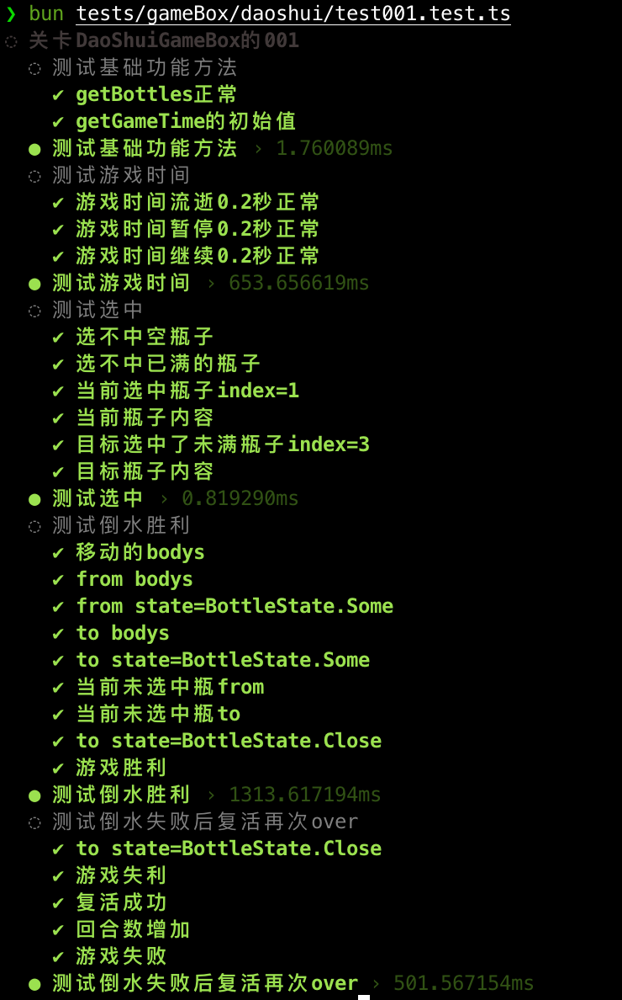

# 单元测试
如果你觉得你的游戏足够简单，就不需要单元测试了。
但是如果你的游戏会逐步给它加功能时，最好养成写单元测试的习惯。

当然如果是你上班`摸鱼`开发,在没法打开cocos界面情况下，只有单元测试是唯一的调试工具。

## 代码测试

在tests/gameBox/daoshui/下面建一个文件`test001.test.ts`

```ts
import { BottleState, DaoShuiGameBox, GameState, IDaoShuiGameBoxData } from "db://assets/script/gameBox/daoshui/DaoShuiGameBox";
import { assert, describe, test } from "poku";
import { TestUtil } from "../../TestUtil";

let data: IDaoShuiGameBoxData = {
    bottles: [
        { bodys: [1, 2, 3], index: 0, state: BottleState.Full },
        { bodys: [1, 2, 3], index: 1, state: BottleState.Full },
        { bodys: [1, 2, 3], index: 2, state: BottleState.Full },
        { bodys: [], index: 3, state: BottleState.Empty },
        { bodys: [1, 1, 1], index: 4, state: BottleState.Close }
    ],
    curIndex: -1,
    targetIndex: -1,
    maxBodyLength: 3,
    maxRound: 8,
    curRound: 0,
    maxMoreRound: 2,
    curMoreRound: 0,
    gameTime: 0,
    gameState: GameState.GameInit,
    lostCount: 0
}

let data_str = JSON.stringify(data)


const test_00 = () => {
    return new Promise((resolve, reject) => {
        test('测试基础功能方法', async () => {
            let game = new DaoShuiGameBox(JSON.parse(data_str))
            let bottles = game.getBottles()
            testCheck('getBottles正常', JSON.stringify(bottles), '[{"bodys":[1,2,3],"index":0,"state":2},{"bodys":[1,2,3],"index":1,"state":2},{"bodys":[1,2,3],"index":2,"state":2},{"bodys":[],"index":3,"state":0},{"bodys":[1,1,1],"index":4,"state":3}]')
            let gameTime = game.getGameTime()
            testCheck('getGameTime的初始值', gameTime, 0)
            resolve(true)
        })
    })
}

const test_01 = () => {
    return new Promise((resolve, reject) => {
        test('测试游戏时间', async () => {
            // 初始化及开始
            let game = new DaoShuiGameBox(JSON.parse(data_str))
            TestUtil.getInstance().setTimePassDt(10).addSystemToTimeUpdate(game)
            TestUtil.getInstance().timePlay()
            game.play()
            await TestUtil.getInstance().waitTimeSystemXms(200)
            testCheck('游戏时间流逝0.2秒正常', game.getGameTime(), 200)
            game.stop()
            await TestUtil.getInstance().waitTimeSystemXms(200)
            testCheck('游戏时间暂停0.2秒正常', game.getGameTime(), 200)
            game.backplay()
            await TestUtil.getInstance().waitTimeSystemXms(200)
            testCheck('游戏时间继续0.2秒正常', game.getGameTime(), 400)
            TestUtil.getInstance().timeStop()
            resolve(true)
        })
    })
}

const test_02 = () => {
    return new Promise((resolve, reject) => {
        test('测试选中', async () => {
            // 初始化及开始
            let game = new DaoShuiGameBox(JSON.parse(data_str))
            // TestUtil.getInstance().setTimePassDt(1000).addSystemToTimeUpdate(game)
            let touch_empty_index = game.touchBottle(3)
            testCheck('选不中空瓶子', touch_empty_index, -1)
            let touch_full_index = game.touchBottle(4)
            testCheck('选不中已满的瓶子', touch_full_index, -1)
            let touch_from_index = game.touchBottle(1)
            testCheck('当前选中瓶子index=1', touch_from_index, 1)
            testCheck('当前瓶子内容', JSON.stringify(game.getCurBottle()), '{"bodys":[1,2,3],"index":1,"state":2}')
            let touch_to_index1 = game.touchBottle(3)
            testCheck('目标选中了未满瓶子index=3', touch_to_index1, 3)
            testCheck('目标瓶子内容', JSON.stringify(game.getTargetBottle()), '{"bodys":[],"index":3,"state":0}')
            resolve(true)
        })
    })
}

const test_03 = () => {
    return new Promise((resolve, reject) => {
        test('测试倒水胜利', async () => {
            // 初始化及开始
            let game = new DaoShuiGameBox(JSON.parse(data_str))
            TestUtil.getInstance().setTimePassDt(100).addSystemToTimeUpdate(game).timePlay()
            game.play()
            // 
            game.touchBottle(1)
            game.touchBottle(3)
            let move_bodys = game.moveBody()
            game.checkGameWinOrLost()
            testCheck('移动的bodys', JSON.stringify(move_bodys), '[3]')
            testCheck('from bodys', JSON.stringify(game.getBottleInfo(1).bodys), '[1,2]')
            testCheck('from state=BottleState.Some', JSON.stringify(game.getBottleInfo(1).state), BottleState.Some)
            testCheck('to bodys', JSON.stringify(game.getBottleInfo(3).bodys), '[3]')
            testCheck('to state=BottleState.Some', JSON.stringify(game.getBottleInfo(3).state), BottleState.Some)
            testCheck('当前未选中瓶from', game.getCurBottle(), null)
            testCheck('当前未选中瓶to', game.getTargetBottle(), null)
            // console.log(game.getData())
            game.touchBottle(0)
            game.touchBottle(3)
            move_bodys = game.moveBody()
            game.checkGameWinOrLost()
            // console.log(game.getData())
            game.touchBottle(2)
            game.touchBottle(3)
            move_bodys = game.moveBody()
            game.checkGameWinOrLost()
            // console.log(game.getData())
            testCheck('to state=BottleState.Close', JSON.stringify(game.getBottleInfo(3).state), BottleState.Close)
            game.touchBottle(1)
            game.touchBottle(0)
            move_bodys = game.moveBody()
            game.checkGameWinOrLost()
            //  
            game.touchBottle(1)
            game.touchBottle(2)
            move_bodys = game.moveBody()
            game.checkGameWinOrLost()
            // console.log(game.getData())
            game.touchBottle(0)
            game.touchBottle(1)
            move_bodys = game.moveBody()
            game.checkGameWinOrLost()
            // console.log(game.getData())
            game.touchBottle(2)
            game.touchBottle(0)
            move_bodys = game.moveBody()
            game.checkGameWinOrLost()
            // console.log(game.getData())
            game.touchBottle(2)
            game.touchBottle(1)
            move_bodys = game.moveBody()
            game.checkGameWinOrLost()

            // console.log(game.getData())

            await TestUtil.getInstance().waitTimeSystemXms(2000)
            game.touchBottle(2)
            game.touchBottle(0)
            move_bodys = game.moveBody()
            game.checkGameWinOrLost()
            testCheck('游戏胜利', game.getGameState(), GameState.GameWin)

            // console.log(game.getData())

            await TestUtil.getInstance().waitTimeSystemXms(2000)
            TestUtil.getInstance().timeStop()
            resolve(true)
        })
    })
}

const test_04 = () => {
    return new Promise((resolve, reject) => {
        test('测试倒水失败后复活再次over', async () => {
            // 初始化及开始
            let game = new DaoShuiGameBox(JSON.parse(data_str))
            TestUtil.getInstance().setTimePassDt(100).addSystemToTimeUpdate(game).timePlay()
            game.play()
            // 
            game.touchBottle(1)
            game.touchBottle(3)
            let move_bodys = game.moveBody()
            game.checkGameWinOrLost()
            // console.log(game.getData())
            game.touchBottle(0)
            game.touchBottle(3)
            move_bodys = game.moveBody()
            game.checkGameWinOrLost()
            // console.log(game.getData())
            game.touchBottle(2)
            game.touchBottle(3)
            move_bodys = game.moveBody()
            game.checkGameWinOrLost()
            // console.log(game.getData())
            testCheck('to state=BottleState.Close', JSON.stringify(game.getBottleInfo(3).state), BottleState.Close)
            game.touchBottle(1)
            game.touchBottle(0)
            move_bodys = game.moveBody()
            game.checkGameWinOrLost()
            //  
            game.touchBottle(1)
            game.touchBottle(2)
            move_bodys = game.moveBody()
            game.checkGameWinOrLost()
            // console.log(game.getData())
            game.touchBottle(0)
            game.touchBottle(1)
            move_bodys = game.moveBody()
            game.checkGameWinOrLost()
            // console.log(game.getData())
            game.touchBottle(2)
            game.touchBottle(0)
            move_bodys = game.moveBody()
            game.checkGameWinOrLost()
            //console.log(game.getData())
            game.touchBottle(1)
            game.touchBottle(0)
            move_bodys = game.moveBody()
            game.checkGameWinOrLost()
            // console.log(game.getData())

            game.touchBottle(0)
            game.touchBottle(1)
            move_bodys = game.moveBody()
            game.checkGameWinOrLost()
            // console.log(game.getData())
            testCheck('游戏失利', game.getGameState(), GameState.GameLost)
            game.gameRevive()
            testCheck('复活成功', game.getGameState(), GameState.GamePlay)
            testCheck('回合数增加', game.getData().curMoreRound, game.getData().maxMoreRound)
            game.touchBottle(1)
            game.touchBottle(0)
            move_bodys = game.moveBody()
            game.checkGameWinOrLost()

            game.touchBottle(0)
            game.touchBottle(1)
            move_bodys = game.moveBody()
            game.checkGameWinOrLost()
            testCheck('游戏失败', game.getGameState(), GameState.GameOver)

            await TestUtil.getInstance().waitTimeSystemXms(2000)
            TestUtil.getInstance().timeStop()
        })
    })
}

let functions = [test_00, test_01, test_02, test_03, test_04]

function testCheck(test_name: string, val: any, need: any) {
    let is_success = val == need
    assert(is_success, test_name);
    if (is_success == false) {
        console.error('测试【' + test_name + '】失败', '需要:', need, '实际:', val)
    }
    return is_success
}

describe('关卡DaoShuiGameBox的001', async () => {
    while (functions.length > 0) {
        await functions.shift()()
        await waitXms() // 为了输出字幕顺序正常(poku的问题)
    }
});
const waitXms = (ms: number = 0) => {
    return new Promise<void>((resolve, reject) => {
        setTimeout(() => {
            resolve()
        }, ms)
    })
}


```

## 执行测试


