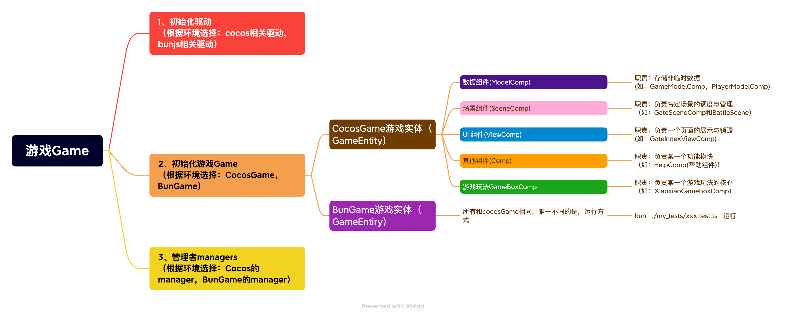

## 架构说明




## 使用说明

本 EC 框架只做两件事：`挂载` 与 `卸载`
目前主要有2种模式
### 1、强引用模式（组件必须存在，不存在就没法启动cocos）
适用场景，明确知道引用组件肯定存在
```ts
// 头部引用
import { LoadResourceToGateComp } from "db://assets/script/comps/enter/LoadResourceToGateComp";
// 
// 其他业务代码
// ...
// 业务中使用
await xhgame.gameEntity.attachComponent(LoadResourceToGateComp).done()
```

### 2、注册引用模式（组件名必须在RegisterComps注册，不存在触发时提示错误）
适用场景，去耦合场景（如希望通过在线组件系统，一键安装\替换的）
```ts
// 无头部引用
// 其他业务代码
// ...
// 业务中直接使用
await xhgame.gameEntity.safeGetComponentByRegisterName('BattleTiledComp').done()
await xhgame.gameEntity.safeGetComponentByRegisterName('BattleViewComp').done()
// 如果存在开发调试页面（相当于预留的钩子）
if (xhgame.gameEntity.isExistComponentByRegisterName('BattleDevViewComp')) {
    await xhgame.gameEntity.attachComponentByRegisterName('BattleDevViewComp').done()
}
```


## 🧩 组件分类

挂载的组件根据功能不同，主要分为以下四类：

### 📦 1. 数据组件  
**职责**：存储非临时数据  
**示例**：  
- `GameModelComp`  
- `PlayerModelComp`  
**命名约定**：以 **`ModelComp`** 结尾

### 🏞️ 2. 场景组件  
**职责**：负责特定场景的调度与管理  
**示例**：  
- `GateSceneComp`  
**命名约定**：以 **`SceneComp`** 结尾

### 🖼️ 3. UI 组件  
**职责**：负责页面展示与交互控制  
**示例**：  
- `GateSignViewComp`（签到弹窗页）  
**命名约定**：以 **`ViewComp`** 结尾

### 📦 4. 玩法组件 
**职责**：负责游戏玩法从开始到胜利的逻辑  
**示例**：  
- `DaoshuiGameBoxComp`（倒水游戏玩法）  
**命名约定**：以 **`GameBoxComp`** 结尾

### ⚙️ 5. 其他组件  
**职责**：处理特定业务逻辑  
**示例**：  
- `HelpComp`（帮助组件）  
- `UnloadBattleComp`（卸载战役组件）  
**命名约定**：以 **`Comp`** 结尾，无特殊后缀要求

---

通过命名约定，更好地组织和管理不同类型的组件，提升代码可读性与可维护性 ✅
